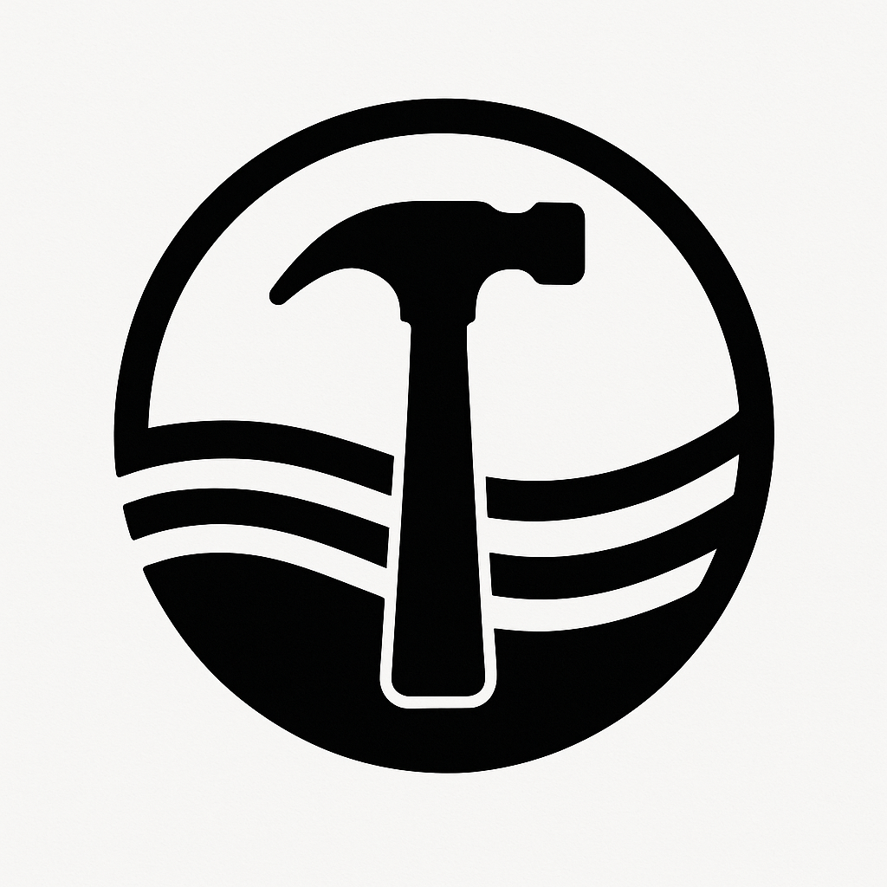

[![Contributors][contributors-shield]][contributors-url]
[![Forks][forks-shield]][forks-url]
[![Stargazers][stars-shield]][stars-url]
[![Issues][issues-shield]][issues-url]
[![Unlicense License][license-shield]][license-url]
[![LinkedIn][linkedin-shield]][linkedin-url]

<!-- PROJECT LOGO -->
 

  

  <h3 align="center">Sola-Kit</h3>

  

Forge your own intelligent AI agents using the core tools and workflows that power Sola AI.
     
    <a href="https://github.com/TheSolaAI/sola-kit"><strong>Explore the docs (Coming Soon) »</strong></a>
     
     
    <a href="https://github.com/TheSolaAI/sola-application">View Demo</a>
    &middot;
    <a href="https://github.com/TheSolaAI/sola-kit/issues/new?labels=bug&template=bug-report---.md">Report Bug</a>
    &middot;
    <a href="https://github.com/TheSolaAI/sola-kit/issues/new?labels=enhancement&template=feature-request---.md">Request Feature</a>
  

<!-- TABLE OF CONTENTS -->

  
Table of Contents

  <ol>
    <li>
      <a href="#about-the-project">About The Project</a>
      <ul>
        <li><a href="#built-with">Built With</a></li>
      </ul>
    </li>
    <li>
      <a href="#getting-started">Getting Started</a>
      <ul>
        <li><a href="#prerequisites">Prerequisites</a></li>
        <li><a href="#installation">Installation</a></li>
      </ul>
    </li>
    <li><a href="#usage">Usage</a></li>
    <li><a href="#roadmap">Roadmap</a></li>
    <li><a href="#contributing">Contributing</a></li>
    <li><a href="#license">License</a></li>
    <li><a href="#contact">Contact</a></li>
    <li><a href="#acknowledgments">Acknowledgments</a></li>
  </ol>

<!-- ABOUT THE PROJECT -->

## About The Project

[![Sola-Kit][product-screenshot]](https://sola.xyz)

Through the development of Sola AI, our flagship voice assistant on the Solana blockchain, we've pioneered a suite of custom implementations and tooling that intricately weave AI LLM's with the crypto and blockchain landscape. Recognizing the broader utility of these solutions, we are now sharing this library with fellow developers. Our aim is to fuel the Solana AI ecosystem, enabling you to seamlessly integrate the very tools that empower Sola AI within your own innovative projects. This library represents the heart and hard-won efficiencies derived from numerous iterations, ensuring both precision and performance. To get started, please consult the installation and requirements section below.

(<a href="#readme-top">back to top</a>)

<!-- GETTING STARTED -->

## Getting Started

Sola Toolkit can be installed as any standard NPM Package

### Prerequisites

Sola Toolkit relies on the AI SDK provided by Vercel as a backbone to structure and format the various tools and workflows that it uses. AI SDK is installed as peer dependency automatically. This may require you to structure your message formats and other tool call formats similar to what is there in AI SDK. Check the docs for more info

### Installation

Coming Soon

<!-- CONTRIBUTING -->

## Contributing

Contributions are what make the open source community such an amazing place to learn, inspire, and create. Any contributions you make are **greatly appreciated**.

If you have a suggestion that would make this better, please fork the repo and create a pull request. You can also simply open an issue with the tag "enhancement".
Don't forget to give the project a star! Thanks again!

1. Fork the Project
2. Create your Feature Branch (`git checkout -b feature/AmazingFeature`)
3. Commit your Changes (`git commit -m 'Add some AmazingFeature'`)
4. Push to the Branch (`git push origin feature/AmazingFeature`)
5. Open a Pull Request

### Top contributors:

(<a href="#readme-top">back to top</a>)

<!-- MARKDOWN LINKS & IMAGES -->
<!-- https://www.markdownguide.org/basic-syntax/#reference-style-links -->

[contributors-shield]: https://img.shields.io/github/contributors/TheSolaAI/sola-kit.svg?style=for-the-badge
[contributors-url]: https://github.com/TheSolaAI/sola-kit/graphs/contributors
[forks-shield]: https://img.shields.io/github/forks/TheSolaAI/sola-kit.svg?style=for-the-badge
[forks-url]: https://github.com/TheSolaAI/sola-kit/network/members
[stars-shield]: https://img.shields.io/github/stars/TheSolaAI/sola-kit.svg?style=for-the-badge
[stars-url]: https://github.com/TheSolaAI/sola-kit/stargazers
[issues-shield]: https://img.shields.io/github/issues/TheSolaAI/sola-kit.svg?style=for-the-badge
[issues-url]: https://github.com/TheSolaAI/sola-kit/issues
[license-shield]: https://img.shields.io/github/license/TheSolaAI/sola-kit.svg?style=for-the-badge
[license-url]: https://github.com/TheSolaAI/sola-kit/blob/master/LICENSE.txt
[linkedin-shield]: https://img.shields.io/badge/-LinkedIn-black.svg?style=for-the-badge&logo=linkedin&colorB=555
[linkedin-url]: https://linkedin.com/in/othneildrew
[product-screenshot]: assets/app-screenshot.png
[Next.js]: https://img.shields.io/badge/next.js-000000?style=for-the-badge&logo=nextdotjs&logoColor=white
[Next-url]: https://nextjs.org/
[React.js]: https://img.shields.io/badge/React-20232A?style=for-the-badge&logo=react&logoColor=61DAFB
[React-url]: https://reactjs.org/
[Vue.js]: https://img.shields.io/badge/Vue.js-35495E?style=for-the-badge&logo=vuedotjs&logoColor=4FC08D
[Vue-url]: https://vuejs.org/
[Angular.io]: https://img.shields.io/badge/Angular-DD0031?style=for-the-badge&logo=angular&logoColor=white
[Angular-url]: https://angular.io/
[Svelte.dev]: https://img.shields.io/badge/Svelte-4A4A55?style=for-the-badge&logo=svelte&logoColor=FF3E00
[Svelte-url]: https://svelte.dev/
[Laravel.com]: https://img.shields.io/badge/Laravel-FF2D20?style=for-the-badge&logo=laravel&logoColor=white
[Laravel-url]: https://laravel.com
[Bootstrap.com]: https://img.shields.io/badge/Bootstrap-563D7C?style=for-the-badge&logo=bootstrap&logoColor=white
[Bootstrap-url]: https://getbootstrap.com
[JQuery.com]: https://img.shields.io/badge/jQuery-0769AD?style=for-the-badge&logo=jquery&logoColor=white
[JQuery-url]: https://jquery.com